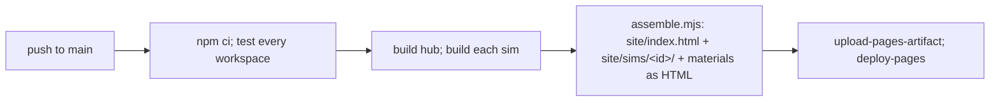

# learnhub: design

Dated 2026-10-03. Status: approved by the owner on 2026-10-03. MVP steps 1 to 4 done (step 4 on 2026-10-04).

## Problem

Each learning tool (the cache simulator first, more later) is a separate app that runs only on this Mac through a development server. There is no single place to find the tools, open one with a button, see progress, or reach them from a phone outside the home network.

## Goals (v1)

1. One public website on GitHub Pages: a catalog page that lists every tool and opens it with one click.
2. The cache simulator is tool #1, served at `/sims/cachesim/`, with its lessons, guide, and verification docs reachable from inside it.
3. Adding a tool means adding a folder and one manifest file. Nothing else in the hub changes.
4. Every push to `main` runs the tests, builds the site, and deploys it. A failing test blocks the deploy.
5. Progress shown on the catalog (lessons done per tool), stored in the viewer's browser.

## Non-goals (v1)

- Accounts, a server, or a database. Progress does not follow you across devices yet.
- A second tool. The structure must make it easy; building one is a separate project.
- A shared component package. The cache simulator keeps its own UI code. Shared parts are extracted when tool #2 needs them, so the shared API is shaped by two real users instead of guessed from one.
- Search, comments, analytics, or any third-party tracker.
- Running benchmarks or VMs from the site. Those stay in the repo and run on your machine.

## Repo layout

```
learnhub/                      new git repo, npm workspaces
├── package.json               workspaces: hub, sims/*
├── hub/                       the catalog site (Vite + Preact, same stack as the sims)
│   ├── src/
│   └── index.html
├── sims/
│   └── cachesim/              the current ~/Brainstorm/cachesim, copied in
│       ├── sim.json           manifest (below)
│       └── ...                unchanged: engine, ui, bench, scripts, docs
├── scripts/
│   └── assemble.mjs           builds hub + every sim into site/
├── .github/workflows/
│   └── pages.yml              test, build, deploy
└── DESIGN.md, README.md, ADDING-A-TOOL.md
```

The original `~/Brainstorm/cachesim` stays where it is until you confirm the copy works; then you delete it. It has no commits, so nothing in its history is lost. Its staged files are copied as files.

## Tool manifest

Each tool declares itself in `sims/<id>/sim.json`. The hub reads only these files.

```json
{
  "id": "cachesim",
  "title": "Cache Hierarchy Simulator",
  "summary": "Watch C++ memory accesses move through L1, L2, L3, and DRAM.",
  "tracks": ["ML-SYS", "HFT", "ALGO"],
  "level": "simulator-with-real-check",
  "minutes": 90,
  "lessons": 10,
  "build": "npm run build",
  "out": "dist",
  "materials": [
    { "label": "Guide", "path": "GUIDE.md" },
    { "label": "Simulator vs real hardware", "path": "VERIFY.md" }
  ],
  "status": "ready"
}
```

`level` uses the ladder from our discussion: `visualizer`, `simulator`, `simulator-with-real-check`, `build-the-model-lab`, `research-instrument`. `status` is `ready`, `beta`, or `planned` (planned tools show on the catalog as coming soon, which doubles as the roadmap).

## Build and deploy



- Each sim already builds with a relative base (`base: './'`), so it works under `/<repo>/sims/<id>/` with no change.
- `assemble.mjs` copies each sim's `out` folder into `site/sims/<id>/`, renders each listed material (Markdown) to a static HTML page next to it, and writes `site/catalog.json` from the manifests.
- The workflow uses GitHub's official Pages actions (`actions/upload-pages-artifact`, `actions/deploy-pages`). No third-party actions.

## Catalog page

- Grouped by track, filterable by track and level.
- Each card: title, one-line summary, level, estimated time, lessons done (for example 3 of 10), and two buttons: **Open** (launches the tool in the same tab) and **Materials** (guide and verification docs).
- Same light theme and tokens as the cache simulator, WCAG AA, works at 320 px.

## Progress contract

Tools and the hub share one origin, so they share `localStorage`. Each tool writes one key:

```
learnhub.progress.<id> = { "done": 3, "total": 10, "updated": "2026-10-03T21:00:00Z" }
```

The cache simulator already stores lesson progress under `cachesim.guided.v1`; a ten-line addition writes the summary key too. All reads and writes stay inside try/catch, so a browser that blocks storage still works, just without progress.

Phase 2 option: sync this key to Supabase so progress follows you across devices. That adds a table and a sign-in, so it needs your go-ahead first.

## GitHub Pages constraints that matter

| constraint | effect |
|---|---|
| Static files only | Fine: every tool is static. |
| No custom HTTP headers | No cross-origin isolation, so no `SharedArrayBuffer`. No current tool needs it; a future one that does would need another host. |
| Project site path `https://<user>.github.io/<repo>/` | Handled by relative bases. A custom domain is optional later. |
| 1 GB site limit, soft 100 GB/month bandwidth | The whole site is about 1 MB today. |
| **Private repos need a paid GitHub plan for Pages** | A free account means a **public** repo, so the source is public. |

## MVP (ruthless)

1. Create `learnhub/`, copy cachesim into `sims/cachesim/`, add `sim.json`, set up workspaces. All 362 cachesim tests pass from the new location.
2. Hub catalog page with one card, plus `assemble.mjs`. `npm run build` at the root produces a working `site/`; previewed locally.
3. GitHub Actions workflow. You create the GitHub repo and push; the first deploy goes live.
4. Progress key written by the cache simulator and shown on its card.

Pause for review after each step, as with the context orchestrator.

## Phase 2 (noted, not built)

- Tool #2, then extract the shared package (tokens, Term and glossary, checked-claim lessons, predict-then-check widget, Try it for real panel).
- Build-the-model lab mode for the cache simulator (bring your own replacement policy or coherence protocol, graded by the existing tests).
- Progress sync through Supabase.
- Custom domain.

## Decisions (owner, 2026-10-03)

1. Public repo (free GitHub Pages).
2. Repo name `learnhub` for now.
3. No `gh`; the owner creates the repo on github.com and pushes, with commands from the README.
4. The catalog shows only tools with `status: ready`. Planned tools stay out of the catalog.
