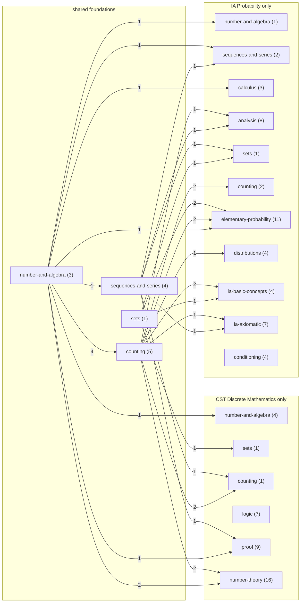
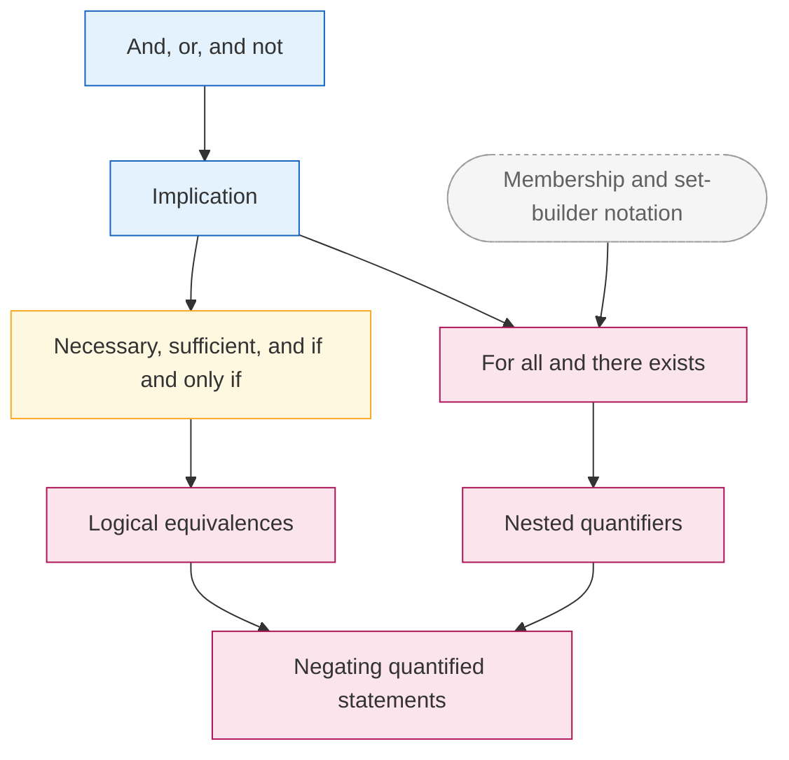
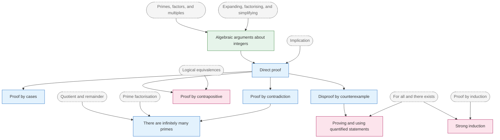
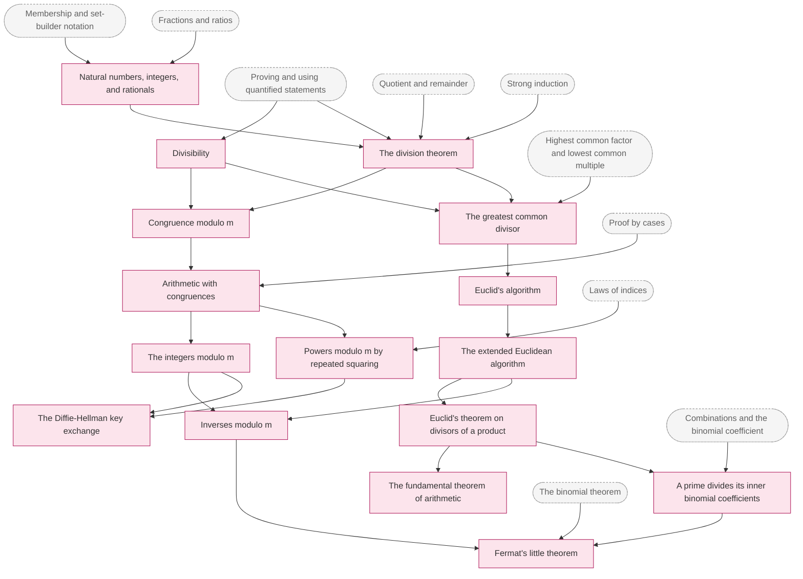
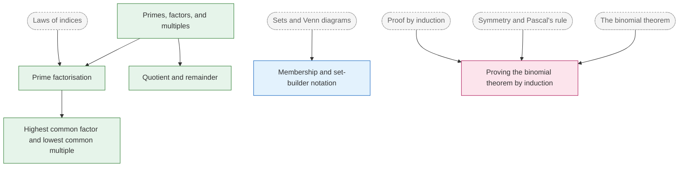

# CST Discrete Mathematics slice graph: review

Dated 2026-10-04. Status: approved by the owner on 2026-10-04, with the changes listed under "Decisions" applied (design decision 14). Topic list and edges only; no lessons, problems, or UI. Built on the shared graph (decision 10) and from scratch (decision 11).

## What the slice covers

The slice is the first two sections of CST IA Discrete Mathematics 2026-27: "Proof" [5 lectures] and "Numbers" [5 lectures], 10 of the course's 24 hours. Below them it has every foundation they need, from GCSE up: primes, factors, remainders, and HCF; algebraic arguments about integers; the logic of and, or, not, and implication; and the A-level and STEP proof methods (direct proof, cases, counterexample, contradiction, if and only if). It reuses the probability slice's foundations wherever the idea is the same: algebraic manipulation, indices, fractions, set notation, sequences and sigma notation, counting, the binomial theorem, Pascal's rule, and induction.

The data lives in `graph/src/topics/` (new areas `logic.ts`, `proof.ts`, `number-theory.ts`, plus additions to `number-and-algebra.ts`, `sets.ts`, and `counting.ts`). The course is `cst-discrete-maths` in `graph/src/courses.ts`: its targets are the topics citing it. `graph/src/schedules.ts` maps each syllabus phrase to its topics, and `graph/src/cst-discrete-maths.test.ts` checks the mapping both ways.

| level | new topics | minutes | hours | in the course closure | minutes | hours |
|---|---|---|---|---|---|---|
| pre-a-level | 5 | 70 | 1.2 | 11 | 165 | 2.8 |
| a-level | 8 | 130 | 2.2 | 13 | 215 | 3.6 |
| step | 1 | 15 | 0.3 | 3 | 55 | 0.9 |
| tripos-ia | 24 | 440 | 7.3 | 24 | 440 | 7.3 |
| **total** | **38** | **655** | **10.9** | **51** | **875** | **14.6** |

The closure is the 38 new topics plus 13 reused from the probability slice (220 minutes). The minutes are first-learning time only. The shared graph now has 98 topics; the two courses' closures cover all of them, with 13 in both.

### Sources

| `doc` | document |
|---|---|
| `cst-courses-2026-27` | [Course pages 2026-27](https://www.cl.cam.ac.uk/teaching/2627/), Department of Computer Science and Technology. This slice cites the [Discrete Mathematics page](https://www.cl.cam.ac.uk/teaching/2627/DiscMath/) (principal lecturer Dr Jon Sterling, Part IA CST, 24 hours), course `CST IA Discrete Mathematics`, sections `Proof` and `Numbers` as printed (without "[5 lectures]"). Read 2026-10-04. |
| `step-spec-2026` | STEP specification, version 1.3, OCR, re-fetched 2026-10-04. Cited for Mathematics 1, Section A: Pure Mathematics, headings "Proof" and "Algebra and functions", and for the notation list (chapter "Notation and Required Formulae", heading "Notation", table "Set notation", page 32). |
| `dfe-gcse-maths-2013` | GCSE subject content, DfE. Cited for "Number: Structure and calculation" items 2 and 4, and "Algebra: Notation, vocabulary and manipulation" item 6. |

### Levels

Same rules as the probability slice. One improvement in method: the STEP spec was read with its font names this time, so bold italics are certain rather than inferred. In "Proof", "proof by induction" and the line "Understand and use the terms 'necessary and sufficient' and 'if and only if'" are Arial Bold Italic (STEP additions, level `step`); proof by deduction, exhaustion, counterexample, and contradiction are plain (A level). "Express solutions through correct use of 'and' and 'or'" in "Algebra and functions" is plain.

## Every new topic

Prerequisites are direct edges only; the validator reports no redundant edge. "CST" is the Discrete Mathematics page.

| # | id | title | level | prereqs | sources | min |
|---|---|---|---|---|---|---|
| 1 | `pre.primes-and-factors` | Primes, factors, and multiples | pre-a-level | none (root) | GCSE: Number: Structure and calculation | 15 |
| 2 | `pre.prime-factorisation` | Prime factorisation | pre-a-level | `pre.primes-and-factors`, `pre.indices` | GCSE: Number: Structure and calculation | 15 |
| 3 | `pre.hcf-lcm` | Highest common factor and lowest common multiple | pre-a-level | `pre.prime-factorisation` | GCSE: Number: Structure and calculation | 15 |
| 4 | `pre.remainders` | Quotient and remainder | pre-a-level | `pre.primes-and-factors` | GCSE: Number: Structure and calculation | 10 |
| 5 | `sets.comprehension` | Membership and set-builder notation | a-level | `pre.set-notation` | STEP spec: Notation and Required Formulae, Notation, Set notation; CST: Discrete Mathematics, Numbers | 15 |
| 6 | `comb.binomial-theorem-proof` | Proving the binomial theorem by induction | tripos-ia | `comb.binomial-theorem`, `comb.binomial-identities`, `alg.proof-by-induction` | CST: Discrete Mathematics, Numbers | 20 |
| 7 | `logic.connectives` | And, or, and not | a-level | none (root) | STEP spec: M1 Pure: Algebra and functions; CST: Discrete Mathematics, Proof | 15 |
| 8 | `logic.implication` | Implication | a-level | `logic.connectives` | STEP spec: M1 Pure: Proof; CST: Discrete Mathematics, Proof | 15 |
| 9 | `logic.iff` | Necessary, sufficient, and if and only if | step | `logic.implication` | STEP spec: M1 Pure: Proof; CST: Discrete Mathematics, Proof | 15 |
| 10 | `logic.equivalences` | Logical equivalences | tripos-ia | `logic.iff` | CST: Discrete Mathematics, Proof | 20 |
| 11 | `logic.quantifiers` | For all and there exists | tripos-ia | `logic.implication`, `sets.comprehension` | CST: Discrete Mathematics, Proof | 15 |
| 12 | `logic.nested-quantifiers` | Nested quantifiers | tripos-ia | `logic.quantifiers` | CST: Discrete Mathematics, Proof | 15 |
| 13 | `logic.negating-quantifiers` | Negating quantified statements | tripos-ia | `logic.nested-quantifiers`, `logic.equivalences` | CST: Discrete Mathematics, Proof | 15 |
| 14 | `pre.algebraic-argument` | Algebraic arguments about integers | pre-a-level | `pre.algebraic-manipulation`, `pre.primes-and-factors` | GCSE: Algebra: Notation, vocabulary and manipulation | 15 |
| 15 | `proof.direct` | Direct proof | a-level | `logic.implication`, `pre.algebraic-argument` | STEP spec: M1 Pure: Proof; CST: Discrete Mathematics, Proof | 20 |
| 16 | `proof.cases` | Proof by cases | a-level | `proof.direct` | STEP spec: M1 Pure: Proof; CST: Discrete Mathematics, Proof | 15 |
| 17 | `proof.counterexample` | Disproof by counterexample | a-level | `proof.direct` | STEP spec: M1 Pure: Proof; CST: Discrete Mathematics, Proof | 10 |
| 18 | `proof.contradiction` | Proof by contradiction | a-level | `proof.direct` | STEP spec: M1 Pure: Proof; CST: Discrete Mathematics, Proof | 20 |
| 19 | `proof.infinitely-many-primes` | There are infinitely many primes | a-level | `proof.contradiction`, `pre.prime-factorisation`, `pre.remainders` | STEP spec: M1 Pure: Proof; CST: Discrete Mathematics, Numbers | 20 |
| 20 | `proof.contrapositive` | Proof by contrapositive | tripos-ia | `logic.equivalences`, `proof.direct` | CST: Discrete Mathematics, Proof | 15 |
| 21 | `proof.quantifier-patterns` | Proving and using quantified statements | tripos-ia | `logic.quantifiers`, `proof.counterexample` | CST: Discrete Mathematics, Proof | 20 |
| 22 | `proof.strong-induction` | Strong induction | tripos-ia | `alg.proof-by-induction`, `logic.quantifiers` | CST: Discrete Mathematics, Numbers | 20 |
| 23 | `num.number-systems` | Natural numbers, integers, and rationals | tripos-ia | `sets.comprehension`, `pre.fractions` | CST: Discrete Mathematics, Numbers | 10 |
| 24 | `num.divisibility` | Divisibility | tripos-ia | `proof.quantifier-patterns` | CST: Discrete Mathematics, Proof | 20 |
| 25 | `num.division-theorem` | The division theorem | tripos-ia | `pre.remainders`, `num.number-systems`, `proof.strong-induction`, `proof.quantifier-patterns` | CST: Discrete Mathematics, Numbers | 25 |
| 26 | `num.congruence` | Congruence modulo m | tripos-ia | `num.divisibility`, `num.division-theorem` | CST: Discrete Mathematics, Proof | 15 |
| 27 | `num.modular-arithmetic` | Arithmetic with congruences | tripos-ia | `num.congruence`, `proof.cases` | CST: Discrete Mathematics, Numbers | 20 |
| 28 | `num.modular-integers` | The integers modulo m | tripos-ia | `num.modular-arithmetic` | CST: Discrete Mathematics, Numbers | 15 |
| 29 | `num.modular-exponentiation` | Powers modulo m by repeated squaring | tripos-ia | `num.modular-arithmetic`, `pre.indices` | CST: Discrete Mathematics, Numbers | 15 |
| 30 | `num.gcd` | The greatest common divisor | tripos-ia | `num.divisibility`, `pre.hcf-lcm`, `num.division-theorem` | CST: Discrete Mathematics, Numbers | 20 |
| 31 | `num.euclid-algorithm` | Euclid's algorithm | tripos-ia | `num.gcd` | CST: Discrete Mathematics, Numbers | 15 |
| 32 | `num.extended-euclid` | The extended Euclidean algorithm | tripos-ia | `num.euclid-algorithm` | CST: Discrete Mathematics, Numbers | 20 |
| 33 | `num.euclid-theorem` | Euclid's theorem on divisors of a product | tripos-ia | `num.extended-euclid` | CST: Discrete Mathematics, Numbers | 20 |
| 34 | `num.modular-inverse` | Inverses modulo m | tripos-ia | `num.extended-euclid`, `num.modular-integers` | CST: Discrete Mathematics, Numbers | 20 |
| 35 | `num.fundamental-theorem` | The fundamental theorem of arithmetic | tripos-ia | `num.euclid-theorem` | CST: Discrete Mathematics, Numbers | 25 |
| 36 | `num.prime-binomial` | A prime divides its inner binomial coefficients | tripos-ia | `num.euclid-theorem`, `comb.combinations` | CST: Discrete Mathematics, Proof | 15 |
| 37 | `num.fermat-little` | Fermat's little theorem | tripos-ia | `num.prime-binomial`, `comb.binomial-theorem`, `num.modular-inverse` | CST: Discrete Mathematics, Proof | 25 |
| 38 | `num.diffie-hellman` | The Diffie-Hellman key exchange | tripos-ia | `num.modular-exponentiation`, `num.modular-integers` | CST: Discrete Mathematics, Numbers | 20 |

## Reused topics

Thirteen topics of the probability slice are in this course's closure. Two got a CST citation, because the syllabus teaches them by name; the rest are foundations the syllabus assumes.

| id | CST citation added | why |
|---|---|---|
| `alg.proof-by-induction` | yes, Numbers | "Mathematical induction" |
| `comb.binomial-identities` | yes, Numbers | "Pascal's Triangle" |
| `comb.binomial-theorem` | no | The syllabus item is the theorem proved by induction; that is the new `comb.binomial-theorem-proof`. The A-level statement stays as it was. See question 6. |
| `pre.set-notation` | no | The syllabus item is "membership and comprehension", the new `sets.comprehension`; unions and intersections belong to the "Sets" section. |
| `pre.algebraic-manipulation`, `pre.fractions`, `pre.indices`, `pre.sequences`, `alg.sigma-notation`, `alg.arithmetic-series`, `pre.product-rule`, `comb.factorial`, `comb.combinations` | no | Foundations only. |

No reused topic changed in id, title, summary, level, area, edges, weights, or minutes. Adding a CST source does not change the engine's view of a topic, and the probability slice's closure is unchanged (60 topics; `SIMULATION.md` is byte-identical in its numbers).

## Syllabus coverage

Every phrase of the two sections maps to at least one topic citing that section, and every topic citing a section is mapped (`cst-discrete-maths.test.ts`).

| section | syllabus phrase | topics |
|---|---|---|
| Proof | Proofs in practice and mathematical jargon | `proof.direct` |
| Proof | Mathematical statements: implication | `logic.implication` |
| Proof | bi-implication | `logic.iff` |
| Proof | universal quantification; existential quantification | `logic.quantifiers`, `logic.nested-quantifiers` |
| Proof | conjunction | `logic.connectives` |
| Proof | disjunction | `logic.connectives`, `proof.cases` |
| Proof | negation | `logic.connectives`, `logic.negating-quantifiers` |
| Proof | Logical deduction: proof strategies and patterns | `proof.direct`, `proof.cases`, `proof.counterexample`, `proof.contrapositive`, `proof.quantifier-patterns` |
| Proof | scratch work | `proof.direct` |
| Proof | logical equivalences | `logic.equivalences`, `proof.contrapositive` |
| Proof | Proof by contradiction | `proof.contradiction` |
| Proof | Divisibility and congruences | `num.divisibility`, `num.congruence` |
| Proof | Fermat's Little Theorem | `num.prime-binomial`, `num.fermat-little` |
| Numbers | Number systems: natural numbers, integers, rationals | `num.number-systems` |
| Numbers | modular integers | `num.modular-integers` |
| Numbers | The Division Theorem and Algorithm | `num.division-theorem` |
| Numbers | Modular arithmetic | `num.modular-arithmetic`, `num.modular-integers`, `num.modular-exponentiation` |
| Numbers | Sets: membership and comprehension | `sets.comprehension` |
| Numbers | The greatest common divisor | `num.gcd` |
| Numbers | Euclid's Algorithm and Theorem | `num.euclid-algorithm`, `num.euclid-theorem` |
| Numbers | The Extended Euclid's Algorithm | `num.extended-euclid` |
| Numbers | multiplicative inverses in modular arithmetic | `num.modular-inverse` |
| Numbers | The Diffie-Hellman cryptographic method | `num.diffie-hellman` |
| Numbers | Mathematical induction | `alg.proof-by-induction`, `proof.strong-induction` |
| Numbers | Binomial Theorem | `comb.binomial-theorem-proof` |
| Numbers | Pascal's Triangle | `comb.binomial-identities` |
| Numbers | Fundamental Theorem of Arithmetic | `num.fundamental-theorem` |
| Numbers | Euclid's infinity of primes | `proof.infinitely-many-primes` |

## The graph by area

### How the two courses share foundations

Each box is an area, split by which course's closure its topics are in; the number is its topic count. Edges show prerequisite counts into and out of the shared foundations and between the two courses. Edges inside one course's own areas are left out; the per-area diagrams of the probability review show those. No edge runs between the two courses' own areas: they meet only in the shared foundations.

### Per-area diagrams

Colors show the level: green pre-A-level, blue A-level, yellow STEP, pink Tripos IA. Gray dashed boxes are prerequisites from other areas. The area overview of the whole graph has no cycles: sets feed logic, logic feeds proof, and proof feeds number theory, never back.

### logic

Statements, connectives, implication, equivalences, and quantifiers.

### proof

Proof methods, from GCSE algebraic arguments to strong induction.

### number-theory

Divisibility, congruences, gcd, and their uses. Every topic is Tripos IA.

### Additions to existing areas

Whole-number foundations in `number-and-algebra`, set-builder notation in `sets`, and the induction proof of the binomial theorem in `counting`.

## Placement test entry points

For Discrete Mathematics alone, the entry points (highest topics at or below STEP on each branch) are 9 topics covering all 27 pre-A-level, A-level, and STEP topics of its closure:

| probe | level | topics credited if correct |
|---|---|---|
| `proof.infinitely-many-primes` | a-level | 11 |
| `comb.binomial-theorem` | a-level | 7 |
| `proof.cases` | a-level | 7 |
| `proof.counterexample` | a-level | 7 |
| `comb.binomial-identities` | step | 6 |
| `alg.proof-by-induction` | step | 5 |
| `pre.hcf-lcm` | pre-a-level | 4 |
| `logic.iff` | step | 3 |
| `sets.comprehension` | a-level | 2 |

Implications:

- **The STEP layer is thin.** Only 3 of the 51 topics are at STEP level, so placement moves from A-level proof methods almost straight into the Tripos. The Tripos topics whose prerequisites are all at or below STEP are `logic.equivalences`, `logic.quantifiers`, `num.number-systems`, and `comb.binomial-theorem-proof`: the first Tripos questions after a learner passes the entry points.
- **Both courses at once need a bigger budget.** Over the union (98 topics), a fixed 30 questions places 44.9% of truthful simulated learners exactly and 40 questions place 100% (`SIMULATION-two-courses.md`). The shortfall at 30 is all under-placement, never over-placement. Resolved by call 12: the default budget now scales with the closure and is 49 here.
- **Truthful learners place exactly.** Learners who know nothing, everything, everything through STEP, or only the probability slice are placed exactly within 40 questions (split) or 45 (entry points); tests in `cst-discrete-maths.test.ts`.

## Two courses at once (simulation)

**Simulation results, not real-learner data.** Generated in `graph/SIMULATION-two-courses.md` from `graph/src/two-courses.test.ts`, with the same learner model as `SIMULATION.md`, starting from nothing, 60 minutes a day, an even split.

Over seeds 1 to 5, the learner masters both slices on every seed: Discrete Mathematics on days 49 to 56 (mean 52.2) and IA Probability on days 54 to 66 (mean 59.8). Lesson minutes charged per course range from 1,120 to 1,205 for IA Probability and 895 to 995 for Discrete Mathematics; IA Probability gets more because it is larger (1,080 against 875 lesson minutes in its closure) and takes all the time after Discrete Mathematics is done. Before either course is done, the two courses' charged minutes differ by at most 35 out of 1,765 to 1,975, depending on the seed.

### The split rule (`planSession`, `courseWeights`)

The planner had no way to split time between courses, so `planSession` now takes `courses` (id and targets for each), `courseWeights` (default 1 each, an even split), and `courseMinutes` (lesson minutes already charged in earlier sessions):

1. The session covers the union of the courses' closures.
2. Reviews are not split. A due review is due whichever course it came from.
3. New lessons are weighted fair queuing on lesson minutes: the next lesson goes to the course with the fewest charged minutes per unit weight, counting earlier sessions, and is that course's best candidate by the existing rules (reviews covered, then area interleaving, then topological order).
4. A shared foundation is charged to the course that takes it, so it is learned once.
5. A course with no lesson that fits yields its time to the next course. Weight 0 pauses a course's new lessons; its reviews continue.

Each lesson task names the course it is charged to, and the plan reports `courseMinutes` for the session. The caller keeps the running totals in progress.

## External checks

From the STEP Support Programme Foundation module list (step.maths.org/assignments/foundation, all three pages, read 2026-10-04), cited in the matching topics' notes:

- **Assignment 3:** "some series work, an introduction to the 'floor' function and a linear Diophantine equation". Matches `num.extended-euclid` (and `pre.remainders` for the floor function).
- **Assignment 4:** "a proof of a circle theorem, sketching inequalities in 2 variables and a couple of logic puzzles". Matches `logic.connectives`.
- **Assignment 12:** "proving divisibility of some expressions, probability and a puzzle". Matches `num.divisibility`.
- **Assignment 17:** "some work with summations, and an introduction to Modular Arithmetic". Matches `num.modular-arithmetic`.
- **Assignment 20:** "some differentiation by first principles and an introduction to induction". Matches `alg.proof-by-induction`.

For the Tripos topics, the check is the course's example sheets and past exam questions, linked from the course page ("Past exam questions"). As before, Albert attempts them under time, marks them, and records the score in CHECKS.md.

## Validator warnings

None. The whole shared graph (98 topics) validates with zero errors and zero warnings.

## Unverified sources

None. Every `section` was read on its page or in its PDF. Caveats that are not about section names:

1. **Euclid's Theorem.** Resolved (call 4). The syllabus says "Euclid's Algorithm and Theorem" without stating the theorem. The official 2023-24 exercise solutions (Discrete Mathematics Exercises 3, M. Fiore, [PDF](https://www.cl.cam.ac.uk/teaching/2324/DiscMath/solutions/DiscMaths3_Sols.pdf)) use it in the coprime form and the prime form, which matches `num.euclid-theorem`.
2. **Remainders at GCSE.** GCSE item 2 covers integer division but does not name the remainder; `pre.remainders` says so in its note.
3. **Natural numbers.** STEP's notation list starts N at 1. Many CS courses start it at 0; the course page does not say. `num.number-systems` flags it.
4. **Topics the syllabus implies but does not name:** `proof.strong-induction`, `num.modular-exponentiation`, and `num.prime-binomial`. Each note says so. `proof.counterexample` now cites "proof strategies and patterns" (call 8).

## Decisions (owner, 2026-10-04)

All 14 calls approved as recommended, with four changes:

- **Call 3:** `sets.comprehension` moved to A level. It now cites the STEP specification's notation list, chapter "Notation and Required Formulae", heading "Notation", table "Set notation" (page 32), as course `STEP Mathematics 2`. Read in the PDF on 2026-10-04: the table defines membership ("is an element of") and writes sets in set-builder form (Q as {p/q : p in Z, q in N}, and the intervals as {x in R : a <= x <= b}). Its Papers column reads "2, 3" with no bullet, so the notation is in the A level guidance, not a STEP addition. The CST citation stays. Effects: the Discrete Mathematics closure has 27 topics at or below STEP (was 26); `sets.comprehension` replaces `pre.set-notation` as the ninth entry point; the probability closure is unchanged.
- **Call 8:** `proof.counterexample` now also cites CST Discrete Mathematics, section `Proof`, mapped to the syllabus phrase "Logical deduction: proof strategies and patterns" in `graph/src/schedules.ts`. It is now a course target, not only an ancestor. The closure is unchanged (51 topics).
- **Call 12:** the placement budget scales with the closure: `placementBudget(n) = max(30, ceil(n / 2))` in `packages/mastery/src/placement.ts`, used by `nextProbe` when no budget is given. One course of the probstats size (60) or smaller keeps 30, and Discrete Mathematics alone (51) gets 30. Both courses (98) get 49. Measured on 1,000 truthful simulated learners, split strategy, seed 1: 44.9% exact at 30, 97.5% at 38, 100% at 40 and at 49, with at most 40 questions asked and 32.7 on average (`SIMULATION-two-courses.md`). Each course alone is placed 100% exactly at 30 (IA Probability needs 28, Discrete Mathematics 20). Tests: `packages/mastery/src/placement.test.ts` and `graph/src/cst-discrete-maths.test.ts`.
- **Call 4:** resolved. The official 2023-24 exercise solutions (Discrete Mathematics Exercises 3, M. Fiore, [PDF](https://www.cl.cam.ac.uk/teaching/2324/DiscMath/solutions/DiscMaths3_Sols.pdf)) use "Euclid's Theorem" in the coprime form (from m/g dividing (n/g)(i - j) with gcd(m/g, n/g) = 1, conclude m/g divides i - j) and in the prime form (p divides (n - 1)(n + 1), so p divides one factor). The assumed statement (if k divides mn and gcd(k, m) = 1 then k divides n, with the prime case as a corollary) matches. Recorded in the topic's note, with the link; the source stays verified.

After these changes the shared graph (98 topics) validates with zero errors and zero warnings. `SIMULATION.md` is unchanged. `SIMULATION-two-courses.md` was regenerated by running `npm test` in `graph` (outside CI the test rewrites it; under `CI=1` it checks it): the placement table gained the 49 row, and the 30 row moved from 45.2% to 44.9% because the A level move changed the placement graph. The day counts did not change.

## Update (2026-10-06): the gatefit prerequisites

The gate-fit audit's prerequisites change both closures. Discrete Mathematics has 59 topics (1,020 lesson minutes), 35 of them at or below STEP: `num.euclid-algorithm` now builds on `alg.fibonacci` and `comb.binomial-theorem-proof` on `mat.matrices`, which bring in seven topics: those two, the geometric series and its sum to infinity, surds, quadratic equations, and simultaneous equations. IA Probability has 90 (see `probstats-slice.md`, "Update (2026-10-06)"). The two share 39 topics, 11 of them at Tripos level: the number theory and proof under `num.fundamental-theorem`, which `prob.point-mass-spaces` now builds on. Nine batch 2 and Preparation topics are ancestors of a target, none a target. The union has 110 topics, so the default budget for both courses is `placementBudget(110) = 55` (was 51); measured on 500 truthful learners, split, seed 1, it places everyone exactly with at most 46 questions. Discrete Mathematics alone keeps 30, and IA Probability alone gets 45 (was 31). Both SIMULATION files were regenerated; with both courses the learner now masters both slices in 70 to 79 days (`SIMULATION-two-courses.md`).

## Update (2026-10-07): four prerequisite fixes

`sets.countable-unions` now builds on `logic.negating-quantifiers`, so IA Probability also reaches `logic.nested-quantifiers`, `logic.equivalences`, and `logic.iff`, all already in Discrete Mathematics. The two courses share 43 topics (was 39); the union is still 110 topics and Discrete Mathematics is unchanged at 59. IA Probability alone gets a budget of 47 (94 topics). With both courses the learner masters both slices in 67 to 86 days (`SIMULATION-two-courses.md`).

## Judgement calls (as raised before approval)

1. **Granularity.** 25 Tripos topics for 10 lectures, 2.5 per lecture, plus 13 new foundations below the Tripos. Too coarse or too fine?
2. **Logic at A level.** `logic.connectives` and `logic.implication` are A-level, citing STEP "Algebra and functions" (the 'and' and 'or' line) and STEP "Proof". Truth tables are not named in STEP. The alternative is Tripos-level topics citing only the CST page. A level puts them in placement's lower layer, where most learners would place out.
3. **Set-builder notation at Tripos level.** `sets.comprehension` cites only the CST page, so it is Tripos IA, although STEP's notation list uses {x : ...}. Move it to A level?
4. **Euclid's Theorem** (caveat 1): is the assumed statement right? **Resolved:** yes, see Decisions, call 4.
5. **Fermat's little theorem by the binomial route.** `num.fermat-little` is proved by induction on a, using that p divides pCk (`num.prime-binomial`), because this course proves the binomial theorem by induction. The other common proof multiplies the residues 1 to p - 1 by a; it would drop the counting edges and keep the inverse one. Either way it needs Euclid's lemma, so the graph puts it after gcd and Euclid, although the syllabus lists it in "Proof", before "Numbers". The graph orders by prerequisites, not lectures. Which proof?
6. **Binomial theorem citation.** CST is cited on Pascal's rule and on the new induction proof, not on the A-level binomial theorem itself. Cite it there too?
7. **Remainders as a GCSE root** (caveat 2). The alternative is to drop `pre.remainders` and let `num.division-theorem` start from nothing, which skips a foundation decision 11 asks for.
8. **Counterexample in the CST closure only through an edge.** It cites STEP only and enters the course as a prerequisite of `proof.quantifier-patterns`. Cite the CST "proof strategies and patterns" line instead?
9. **Left out.** The irrationality of root 2 (STEP names it; a lesson example for contradiction); linear Diophantine equations in general (Assignment 3; could follow `num.extended-euclid`); functions as mappings (decision 14 lists them, but Proof and Numbers do not need them; they enter with the "Sets" section, "Partial and (total) functions"); the Chinese remainder theorem and RSA (not in the syllabus). Include any?
10. **Strong induction and fast modular powers** are not named in the syllabus but are what the Fundamental Theorem of Arithmetic and Diffie-Hellman need. Keep them as topics, or fold them into those topics' lessons?
11. **Encompass weights.** Same scale as the probability review, call 10: 0.6 to 0.7 when every problem exercises the prerequisite, 0.3 to 0.5 for some steps, 0.2 for a light touch. Still guesses until real review data exists.
12. **Placement budget for two courses.** 30 questions place 45% exactly over both courses; 40 place 100%. Options: raise the default to 40; scale the budget with the closure size; or place each course separately. Recommendation: scale with closure size, which keeps 30 for one course.
13. **The split rule.** Shared foundations are charged to whichever course is behind when they are taken. The alternative is to charge half to each. The even split is on lesson minutes; reviews are unsplit. Right?
14. **`extraTargets` for IA Probability.** `comb.binomial-identities` is the one topic of the probability slice no IA Probability section cites (kept for random walks). The course lists it as an extra target so its closure stays the reviewed 60. It is now also a CST target.
