# Probability slice graph: review

Dated 2026-10-04. Status: first review gate of the mastery course (see `mastery/DESIGN.md`). Topic list and edges only; no lessons, problems, engine, or UI yet.

Moved on 2026-10-04 from `courses/probstats/graph/REVIEW.md` when the topics joined the shared graph (design decision 10). The record below is as approved, except for file paths. The topics now live in `graph/src/topics/`, one file per area, and each cites a list of `sources` instead of one `source`; ids, titles, summaries, levels, areas, edges, weights, and minutes are unchanged. The slice is the closure of the course `ia-probability` (`graph/src/courses.ts`).

## What the slice covers

The slice runs from GCSE-level roots (fractions, algebra, indices, sets, the product rule) up to the first two sections of IA Probability: "Basic concepts" [3 lectures] and "Axiomatic approach" [5 lectures]. In between it has the A-level and STEP material those sections lean on (counting, the binomial theorem, A-level probability, the binomial and Poisson distributions), and the slices of Analysis I and Numbers and Sets they need (limits, series of nonnegative terms, bounded monotone sequences, countable unions, the exponential series, and the limit of (1 + x/n)^n).

The data lives in `graph/src/topics/`. `graph/src/graph.test.ts` runs the shared validator from `packages/mastery` on it.

| level | topics | minutes | hours |
|---|---|---|---|
| pre-a-level | 11 | 170 | 2.8 |
| a-level | 16 | 280 | 4.7 |
| step | 10 | 175 | 2.9 |
| tripos-ia | 23 | 455 | 7.6 |
| **total** | **60** | **1,080** | **18.0** |

The minutes are first-learning time only, not reviews. At 60 minutes a day that is 18 sessions if nothing is placed out. If placement credits the pre-A-level and A-level topics (450 minutes), about 10.5 hours remain, roughly 11 sessions plus reviews, which fits the two-week success test in the design.

### Sources

| `doc` | document |
|---|---|
| `dfe-gcse-maths-2013` | [Mathematics GCSE subject content and assessment objectives](https://assets.publishing.service.gov.uk/government/uploads/system/uploads/attachment_data/file/254441/GCSE_mathematics_subject_content_and_assessment_objectives.pdf), DfE, November 2013, DFE-00233-2013. The STEP spec says questions may need higher-tier GCSE content, and links this document. |
| `step-spec-2026` | [STEP Mathematics Specifications for Examinations from June 2026 onwards](https://www.ocr.org.uk/Images/696329-step-specification-2026.pdf), version 1.3, OCR. Sections are cited as paper, section, then heading, for example "Mathematics 1, Section A: Pure Mathematics, Sequences and series". |
| `tripos-schedules-2026-27` | [Schedules of Lecture Courses and Form of Examinations for the Mathematical Tripos 2026-27](https://www.maths.cam.ac.uk/undergrad/files/schedules.pdf), revised 19 August 2026. Sections are cited as course, then heading, for example "IA Probability, Axiomatic approach". |

### Levels

- **pre-a-level:** in the GCSE subject content.
- **a-level:** in STEP "Mathematics 1" in plain type, which the spec says is the DfE A level Mathematics content.
- **step:** a STEP addition (printed in bold italics in Mathematics 1) or STEP Mathematics 2 content.
- **tripos-ia:** in a Part IA schedule.

No topic requires a topic from a higher level; `graph.test.ts` checks this.

## Every topic

Prerequisites are the direct edges only. The validator warns about any edge already implied by another prerequisite, and there are none. Abbreviations in the source column: M1 is STEP Mathematics 1; Schedules is the Tripos schedules.

| # | id | title | level | prereqs | source | min |
|---|---|---|---|---|---|---|
| 1 | `pre.fractions` | Fractions and ratios | pre-a-level | none (root) | GCSE: Number: Structure and calculation | 15 |
| 2 | `pre.algebraic-manipulation` | Expanding, factorising, and simplifying | pre-a-level | none (root) | GCSE: Algebra: Notation, vocabulary and manipulation | 20 |
| 3 | `pre.indices` | Laws of indices | pre-a-level | none (root) | GCSE: Number: Structure and calculation | 15 |
| 4 | `alg.exp-and-ln` | The exponential function and natural logarithm | a-level | `pre.indices` | STEP spec: M1 Pure: Exponentials and logarithms | 20 |
| 5 | `pre.sequences` | Sequences and nth term rules | pre-a-level | `pre.algebraic-manipulation` | GCSE: Algebra: Sequences | 15 |
| 6 | `alg.sigma-notation` | Sigma notation | a-level | `pre.sequences` | STEP spec: M1 Pure: Sequences and series | 15 |
| 7 | `alg.arithmetic-series` | Arithmetic series | a-level | `alg.sigma-notation` | STEP spec: M1 Pure: Sequences and series | 15 |
| 8 | `alg.geometric-series` | Finite geometric series | a-level | `alg.sigma-notation`, `pre.indices` | STEP spec: M1 Pure: Sequences and series | 15 |
| 9 | `alg.geometric-sum-to-infinity` | Sum to infinity of a geometric series | a-level | `alg.geometric-series` | STEP spec: M1 Pure: Sequences and series | 15 |
| 10 | `alg.proof-by-induction` | Proof by induction | step | `alg.arithmetic-series` | STEP spec: M1 Pure: Proof | 20 |
| 11 | `calc.derivatives` | Differentiating powers, e^x, and ln x | a-level | `alg.exp-and-ln`, `pre.algebraic-manipulation` | STEP spec: M1 Pure: Differentiation | 25 |
| 12 | `calc.definite-integrals` | Definite integrals and the fundamental theorem | a-level | `calc.derivatives` | STEP spec: M1 Pure: Integration | 20 |
| 13 | `calc.integration-by-parts` | Integration by parts | a-level | `calc.definite-integrals` | STEP spec: M1 Pure: Integration | 20 |
| 14 | `an.sequence-limits` | Limits of sequences | step | `pre.sequences` | STEP spec: M1 Pure: Sequences and series | 15 |
| 15 | `an.epsilon-limit` | The epsilon definition of convergence | tripos-ia | `an.sequence-limits` | Schedules: IA Analysis I, Limits and convergence | 25 |
| 16 | `an.limit-algebra` | Limits of sums, products, and quotients | tripos-ia | `an.epsilon-limit` | Schedules: IA Analysis I, Limits and convergence | 20 |
| 17 | `an.monotone-convergence` | Bounded monotone sequences converge | tripos-ia | `an.epsilon-limit` | Schedules: IA Numbers and Sets, The real numbers | 20 |
| 18 | `an.series-convergence` | Convergence of an infinite series | tripos-ia | `an.limit-algebra`, `alg.geometric-sum-to-infinity` | Schedules: IA Analysis I, Limits and convergence | 20 |
| 19 | `an.nonnegative-series` | Series of nonnegative terms | tripos-ia | `an.series-convergence`, `an.monotone-convergence` | Schedules: IA Analysis I, Limits and convergence | 20 |
| 20 | `an.exp-series` | The exponential series | step | `alg.exp-and-ln`, `comb.factorial`, `alg.geometric-sum-to-infinity` | STEP spec: STEP 2 Pure: Further algebra and functions | 15 |
| 21 | `an.exp-limit` | The limit of (1 + x/n)^n | step | `calc.derivatives`, `an.sequence-limits` | STEP spec: M1 Pure: Exponentials and logarithms | 20 |
| 22 | `pre.set-notation` | Sets and Venn diagrams | pre-a-level | none (root) | GCSE: Probability | 15 |
| 23 | `sets.countable-unions` | Countable sets and countable unions | tripos-ia | `pre.set-notation`, `pre.sequences` | Schedules: IA Numbers and Sets, Countability and uncountability | 20 |
| 24 | `pre.product-rule` | The product rule for counting | pre-a-level | none (root) | GCSE: Number: Structure and calculation | 15 |
| 25 | `comb.factorial` | Factorials and arranging n objects | a-level | `pre.product-rule` | STEP spec: M1 Pure: Sequences and series | 15 |
| 26 | `comb.permutations` | Permutations of r objects from n | step | `comb.factorial` | STEP spec: M1 Pure: Sequences and series | 15 |
| 27 | `comb.combinations` | Combinations and the binomial coefficient | a-level | `comb.factorial`, `pre.fractions` | STEP spec: M1 Pure: Sequences and series | 20 |
| 28 | `comb.repeated-arrangements` | Arrangements with repeated objects | step | `comb.combinations` | STEP spec: M1 Pure: Sequences and series | 20 |
| 29 | `comb.binomial-identities` | Symmetry and Pascal's rule | step | `comb.combinations`, `pre.algebraic-manipulation` | STEP spec: M1 Pure: Sequences and series | 20 |
| 30 | `comb.binomial-theorem` | The binomial theorem | a-level | `comb.combinations`, `pre.indices`, `pre.algebraic-manipulation` | STEP spec: M1 Pure: Sequences and series | 20 |
| 31 | `pre.probability-scale` | Probability of equally likely outcomes | pre-a-level | `pre.fractions` | GCSE: Probability | 15 |
| 32 | `pre.sample-spaces` | Sample spaces for combined experiments | pre-a-level | `pre.probability-scale`, `pre.product-rule` | GCSE: Probability | 15 |
| 33 | `pre.mutually-exclusive` | Mutually exclusive events | pre-a-level | `pre.probability-scale`, `pre.set-notation` | GCSE: Probability | 10 |
| 34 | `pre.tree-diagrams` | Tree diagrams | pre-a-level | `pre.sample-spaces` | GCSE: Probability | 20 |
| 35 | `pre.two-way-tables` | Conditional probability from tables and Venn diagrams | pre-a-level | `pre.tree-diagrams`, `pre.set-notation` | GCSE: Probability | 15 |
| 36 | `prob.addition-rule` | The addition rule for two events | a-level | `pre.mutually-exclusive` | STEP spec: M1 Prob/Stats: Probability | 15 |
| 37 | `prob.inclusion-exclusion-three` | Inclusion-exclusion for three events | step | `prob.addition-rule` | STEP spec: M1 Prob/Stats: Probability | 15 |
| 38 | `prob.independent-events` | Independent events | a-level | `pre.tree-diagrams` | STEP spec: M1 Prob/Stats: Probability | 15 |
| 39 | `prob.conditional-formula` | The conditional probability formula | a-level | `pre.two-way-tables` | STEP spec: M1 Prob/Stats: Probability | 15 |
| 40 | `prob.counting-probability` | Probability by counting | step | `comb.permutations`, `comb.combinations`, `pre.sample-spaces` | STEP spec: M1 Prob/Stats: Probability | 20 |
| 41 | `prob.discrete-distributions` | Discrete probability distributions | a-level | `pre.sample-spaces` | STEP spec: M1 Prob/Stats: Statistical distributions | 15 |
| 42 | `prob.binomial-distribution` | The binomial distribution | a-level | `prob.discrete-distributions`, `comb.combinations`, `prob.independent-events` | STEP spec: M1 Prob/Stats: Statistical distributions | 20 |
| 43 | `prob.poisson-distribution` | The Poisson distribution | step | `prob.discrete-distributions`, `an.exp-series` | STEP spec: STEP 2 Prob/Stats: Probability distributions | 15 |
| 44 | `prob.geometric-distribution` | The geometric distribution | tripos-ia | `prob.point-mass-spaces`, `prob.independence` | Schedules: IA Probability, Axiomatic approach | 15 |
| 45 | `prob.poisson-binomial-limit` | The Poisson limit of the binomial | tripos-ia | `prob.binomial-distribution`, `prob.poisson-distribution`, `an.exp-limit`, `prob.point-mass-spaces` | Schedules: IA Probability, Axiomatic approach | 25 |
| 46 | `prob.classical-probability` | Classical probability on a finite sample space | tripos-ia | `prob.counting-probability`, `pre.set-notation` | Schedules: IA Probability, Basic concepts | 15 |
| 47 | `prob.sampling-models` | Ordered and unordered samples, with and without replacement | tripos-ia | `prob.classical-probability`, `comb.repeated-arrangements` | Schedules: IA Probability, Basic concepts | 25 |
| 48 | `prob.stirling-log` | Asymptotics of log n! | tripos-ia | `calc.integration-by-parts`, `comb.factorial`, `an.limit-algebra` | Schedules: IA Probability, Basic concepts | 25 |
| 49 | `prob.stirling-formula` | Stirling's formula | tripos-ia | `prob.stirling-log`, `comb.combinations` | Schedules: IA Probability, Basic concepts | 20 |
| 50 | `prob.axioms` | The axioms of probability, countable case | tripos-ia | `prob.classical-probability`, `sets.countable-unions`, `an.nonnegative-series` | Schedules: IA Probability, Axiomatic approach | 20 |
| 51 | `prob.point-mass-spaces` | Probability spaces on a countable set | tripos-ia | `prob.axioms`, `prob.discrete-distributions` | Schedules: IA Probability, Axiomatic approach | 20 |
| 52 | `prob.axiom-consequences` | First consequences of the axioms | tripos-ia | `prob.axioms`, `prob.addition-rule` | Schedules: IA Probability, Axiomatic approach | 15 |
| 53 | `prob.inclusion-exclusion` | The inclusion-exclusion formula | tripos-ia | `prob.axiom-consequences`, `prob.inclusion-exclusion-three`, `alg.proof-by-induction`, `comb.binomial-theorem` | Schedules: IA Probability, Axiomatic approach | 25 |
| 54 | `prob.continuity` | Continuity of probability measures | tripos-ia | `prob.axiom-consequences` | Schedules: IA Probability, Axiomatic approach | 20 |
| 55 | `prob.subadditivity` | Countable subadditivity | tripos-ia | `prob.axiom-consequences` | Schedules: IA Probability, Axiomatic approach | 15 |
| 56 | `prob.independence` | Independence of several events | tripos-ia | `prob.independent-events`, `prob.axiom-consequences` | Schedules: IA Probability, Axiomatic approach | 20 |
| 57 | `prob.conditional-probability` | Conditional probability as a probability measure | tripos-ia | `prob.conditional-formula`, `prob.axiom-consequences` | Schedules: IA Probability, Axiomatic approach | 20 |
| 58 | `prob.total-probability` | The law of total probability | tripos-ia | `prob.conditional-probability` | Schedules: IA Probability, Axiomatic approach | 15 |
| 59 | `prob.bayes-formula` | Bayes's formula | tripos-ia | `prob.total-probability` | Schedules: IA Probability, Axiomatic approach | 20 |
| 60 | `prob.simpsons-paradox` | Simpson's paradox | tripos-ia | `prob.total-probability` | Schedules: IA Probability, Axiomatic approach | 15 |

## The graph by area

### Area overview

Each box is an area with its topic count; each edge label is the number of prerequisite edges between the two areas.

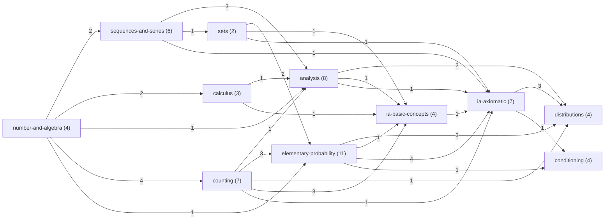

### Per-area diagrams

Colors show the level: green pre-A-level, blue A-level, yellow STEP, pink Tripos IA. Gray dashed boxes are prerequisites from other areas.

### number-and-algebra

Fraction, algebra, and index skills, plus e^x and ln x.

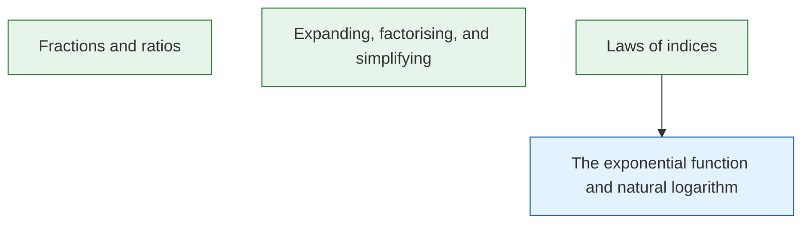

### sequences-and-series

Sequences, sigma notation, arithmetic and geometric series, and induction.

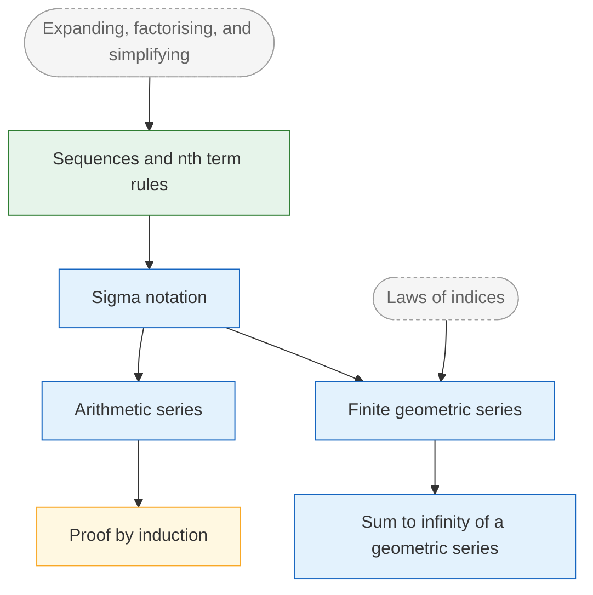

### calculus

Only the calculus that the log n! proof and the exponential limit need.

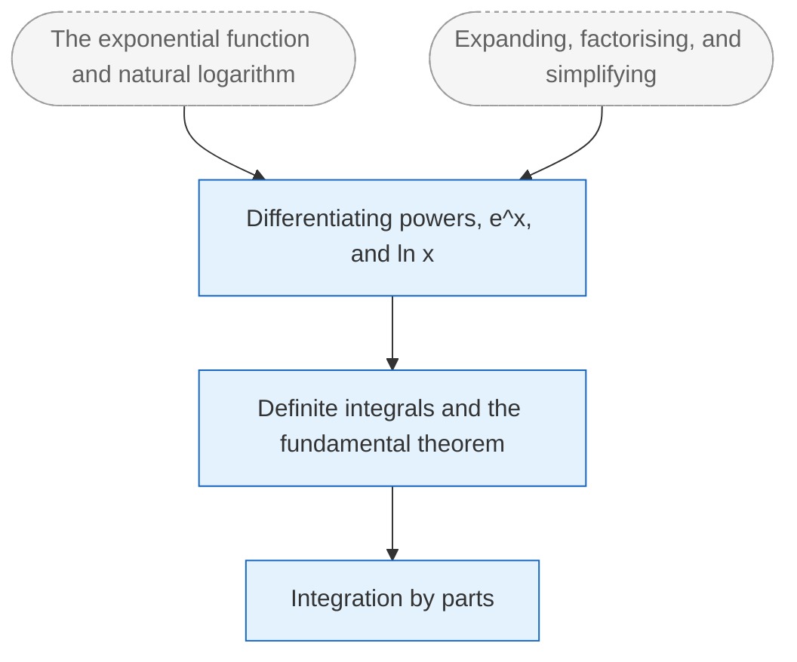

### analysis

Limits and series from Analysis I and Numbers and Sets, plus the two exponential facts.

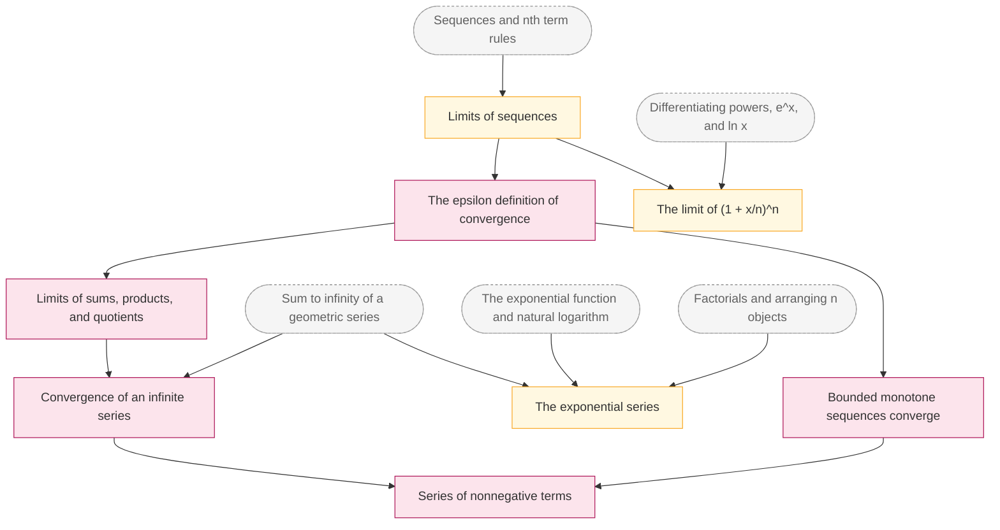

### sets

Set notation, then countable unions for the countable additivity axiom.

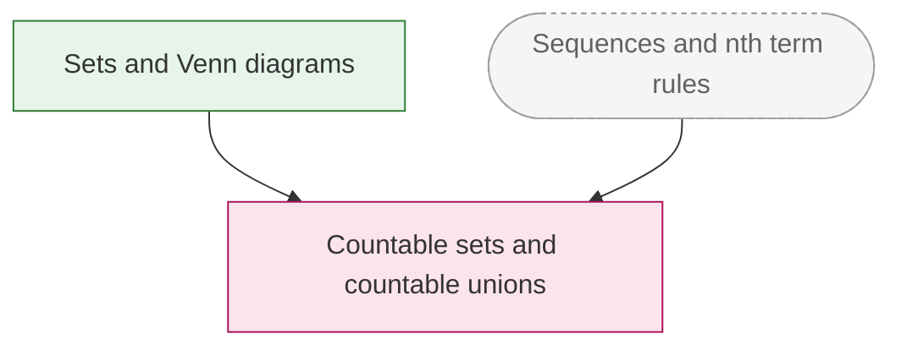

### counting

From the product rule to the binomial theorem.

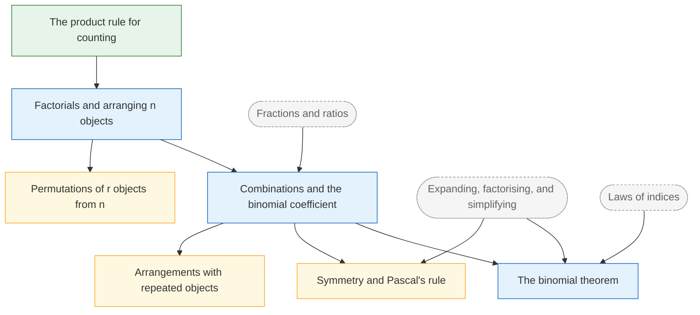

### elementary-probability

GCSE, A-level, and STEP probability before the axioms.

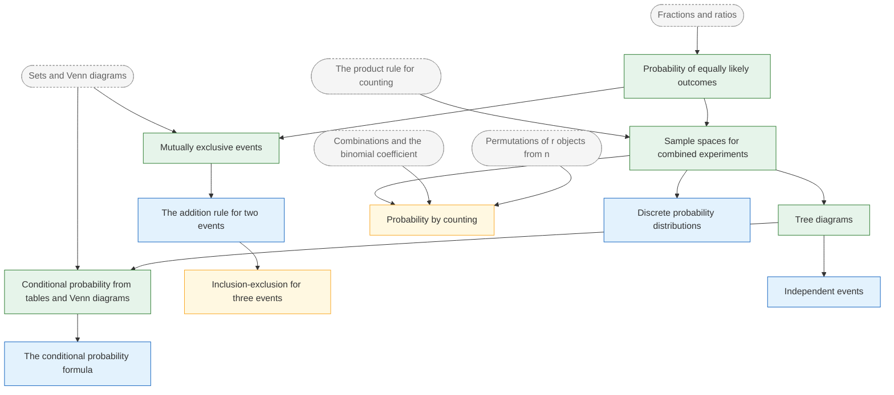

### distributions

Binomial, Poisson, and geometric, and the Poisson limit.

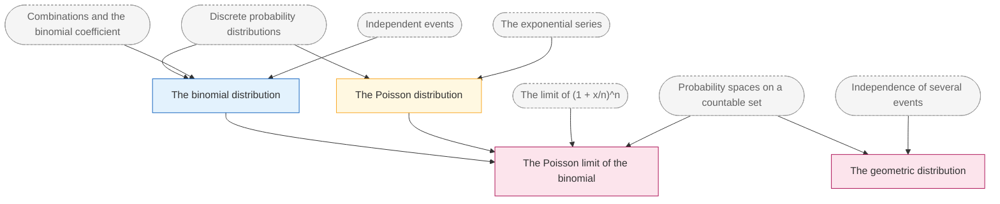

### ia-basic-concepts

IA Probability "Basic concepts" [3 lectures].

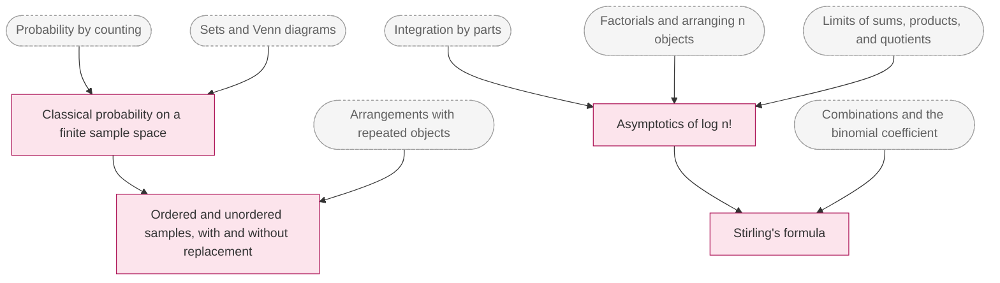

### ia-axiomatic

IA Probability "Axiomatic approach" [5 lectures], except conditioning and distributions.

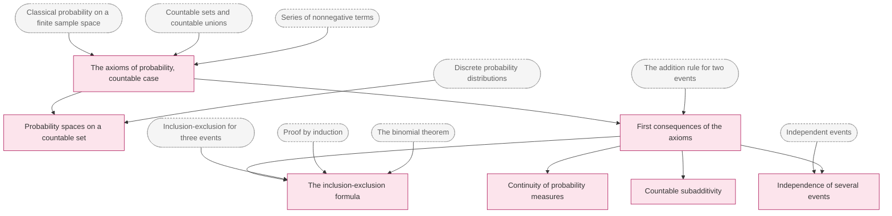

### conditioning

Conditional probability, total probability, Bayes, and Simpson.

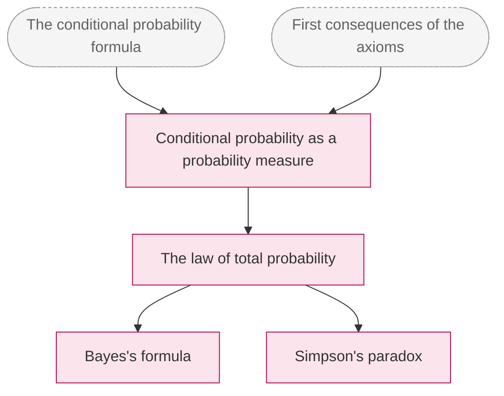

## Placement test entry points

The placement test starts at the top of the STEP layer, not at the roots. A correct answer at a topic credits it and every ancestor, so each probe below confirms between 5 and 15 topics at once. Together these 11 topics have all 37 pre-A-level, A-level, and STEP topics as ancestors (checked with `ancestors` while writing this doc), so 11 correct answers place Albert at the start of the Tripos material.

Each probe is a topic at or below STEP with no descendant at or below STEP: the highest point of the STEP layer on its branch. Probe order is by topics credited, largest first.

| order | probe | level | topics credited if correct | why |
|---|---|---|---|---|
| 1 | `prob.poisson-distribution` | step | 15 | Exercises the exponential series, factorials, and distributions in one question. |
| 2 | `prob.binomial-distribution` | a-level | 10 | Combinations, independence, and tree diagrams together. |
| 3 | `prob.counting-probability` | step | 8 | The core STEP counting skill; parent of classical probability. |
| 4 | `prob.conditional-formula` | a-level | 8 | The conditioning branch, down to two-way tables. |
| 5 | `comb.binomial-theorem` | a-level | 7 | Needed by inclusion-exclusion. |
| 6 | `an.exp-limit` | step | 7 | Covers the derivative of ln and sequence limits. |
| 7 | `calc.integration-by-parts` | a-level | 6 | The whole calculus branch, which only the log n! proof needs. |
| 8 | `prob.inclusion-exclusion-three` | step | 6 | The addition rule and mutually exclusive events. |
| 9 | `comb.binomial-identities` | step | 6 | Pascal's rule; a leaf in this slice, kept for later random walks. |
| 10 | `alg.proof-by-induction` | step | 5 | Covers arithmetic series and sigma notation. |
| 11 | `comb.repeated-arrangements` | step | 5 | The arrangements in STEP Support Foundation Assignment 6. |

On a wrong answer, the test moves down that probe's ancestors, halfway down the longest chain first, so a gap is found in about log2(depth) questions. For example, a miss on `prob.binomial-distribution` probes `prob.independent-events` and `comb.combinations` next.

If every probe is correct, the test moves up to the Tripos entry points: `an.epsilon-limit` (the analysis chain), `prob.classical-probability`, and then `prob.axioms`, `prob.stirling-log`, and `prob.conditional-probability`.

### Update (2026-10-06): the gatefit prerequisites

The gate-fit audit of 2026-10-06 added prerequisites so that every gate problem needs only its own lesson and what it builds on. Five of them bring 28 more topics into the IA Probability closure, which is now 90 topics (1,590 lesson minutes): `prob.point-mass-spaces` builds on `num.fundamental-theorem` and `prob.independence` (its gate is Euler's product formula, which needs unique factorisation; 20 of the 28 come in this way), `prob.geometric-distribution` on `rv.expectation-algebra`, `sets.countable-unions` on `logic.quantifiers`, `alg.geometric-sum-to-infinity` on `alg.surds`, and `an.exp-series` on `calc.differentiation-rules`. The entry points are now these 14, with 55 topics at or below STEP:

| order | probe | level | topics credited if correct |
|---|---|---|---|
| 1 | `rv.expectation-algebra` | step | 22 |
| 2 | `prob.poisson-distribution` | step | 18 |
| 3 | `comb.binomial-identities` | step | 12 |
| 4 | `alg.fibonacci` | step | 12 |
| 5 | `an.exp-limit` | step | 11 |
| 6 | `prob.binomial-distribution` | a-level | 10 |
| 7 | `prob.bayes-two-events` | step | 9 |
| 8 | `prob.counting-probability` | step | 8 |
| 9 | `proof.counterexample` | a-level | 8 |
| 10 | `prob.inclusion-exclusion-three` | step | 6 |
| 11 | `calc.integration-by-parts` | a-level | 6 |
| 12 | `comb.repeated-arrangements` | step | 5 |
| 13 | `pre.hcf-lcm` | pre-a-level | 4 |
| 14 | `sets.comprehension` | a-level | 2 |

`comb.binomial-theorem` and `alg.proof-by-induction` are no longer entry points: `comb.binomial-identities` now builds on both. The default placement budget for the course is `placementBudget(90) = max(30, ceil(90 / 2)) = 45`, up from 31; measured on 500 truthful random learners it places everyone exactly with at most 37 questions (`graph/src/placement.test.ts`). The simulation runs for 120 days instead of 60, since at 60 days some seeds had not finished the larger slice (`graph/SIMULATION.md`).

### Update (2026-10-07): four prerequisite fixes

`an.sequence-limits` builds on `pre.sequences` again, not on induction (its gate is done by unrolling the recurrence); `alg.recurrence-sequences` and `prob.inclusion-exclusion` build on `alg.proof-by-induction` directly, since their gates use induction. `sets.countable-unions` builds on `logic.negating-quantifiers` (its gates negate and nest quantifiers), which brings `logic.nested-quantifiers`, `logic.equivalences`, and `logic.iff` in: the slice is 94 topics (1,655 lesson minutes). `prob.point-mass-spaces` builds on `prob.continuity`, which makes `bp.extinction`'s own edge to it redundant. `proof.direct` does not build on `pre.hcf-lcm`, which the book places later; its gate `ns2-q15` lists it under "Also needs". The entry points are now 15: `an.exp-limit` credits 7 (was 11) and `logic.iff` (6) is new. The default budget is `placementBudget(94) = 47`; measured, it places everyone exactly with at most 39 questions. Both SIMULATION files were regenerated.

## External checks

From the STEP Support Programme Foundation module list (step.maths.org/assignments/foundation, read 2026-10-04):

- **Assignment 6:** "arrangements and some problems with probability, including the 'Prosecutor's fallacy'". Matches the counting, probability-by-counting, and Bayes topics.
- **Assignment 12:** includes "probability". The page does not say which probability topics.

Albert attempts these under time after the STEP layer, marks them against the published solutions, and records the score in CHECKS.md, as the design says.

## Validator warnings

None. The redundant-edge check and the unverified-source check both run and report nothing.

## Unverified sources

None. Every `section` was read in the source document itself:

- **Tripos schedules:** read in the extracted text of the 2026-27 PDF. The two-column layout interleaves IA Analysis I with IA Probability, so each Probability line was matched to its own heading.
- **STEP spec:** downloaded from OCR (version 1.3) and read in full for Mathematics 1, Mathematics 2, and Mathematics 3, Section C.
- **GCSE subject content:** downloaded from gov.uk.

Two caveats are not about section names, and both are worth a glance against the PDFs:

1. **Bold italics in the STEP spec.** The text extraction keeps bold italics only on mathematical symbols, so the line "Use n! and nCr in the context of permutations and combinations" reads as bold because its `n!` is bold. That is the basis for putting permutations at `step` but combinations at `a-level`.
2. **GCSE item numbers.** The extraction merges the item numbers in a few places, for example "3. 4. 5. 6. 7. 8. 9." followed by the texts. The item numbers in `note` were assigned by order.

## Decisions (owner, 2026-10-04)

All recommendations approved. Calls 1 to 8, 10, and 12 stand as written below. Two changes were made:
- **Call 9:** every source now has a `course` field (for example `IA Probability`, `STEP Mathematics 1`, `GCSE Mathematics`), and `section` holds only the section name as the source prints it. The validator rejects a source without a course.
- **Call 11:** the shared validator now rejects a prerequisite at a higher level than the topic that needs it (`level-inversion`), for every course. The course's own copy of that test was removed.

## Judgement calls (as raised before approval)

1. **Granularity.** 60 topics total, 23 of them at Tripos level, for 8 lectures. That is about 2 IA Probability topics per lecture, plus the Analysis I and Numbers and Sets slices. Too coarse or too fine?
2. **Merged to stay at 60.** Ratio into fractions. Modulus inequalities into the epsilon definition. Bounding a sum by integrals and the meaning of a_n ~ b_n into the log n! topic. Sum of binomial coefficients equals 2^n into the binomial theorem. Unordered samples with replacement (stars and bars) into sampling models, via repeated arrangements. Basic differentiation into one topic on powers, e^x, and ln x. Should any of these be split?
3. **Left out.** A STEP-level topic on the Poisson approximation to the binomial (the IA limit topic covers it with proof); derangements (a good inclusion-exclusion example, better as a lesson example); indicator functions and absolute convergence (needed for expectation, the next slice); the birthday problem (a lesson example). Include any?
4. **Sequences and sigma notation are not roots.** The brief listed them among the roots. Sequences need algebraic manipulation, and sigma notation needs sequences, so they sit one and two steps above the five roots. Roots must be pre-A-level or A-level, which they are.
5. **Binomial and Poisson in IA.** The schedule lists "Binomial, Poisson and geometric distributions". Binomial and Poisson enter at A-level and STEP, and the IA view (a distribution as a probability space on a countable set) is `prob.point-mass-spaces`. Only geometric gets its own IA topic. Do you want separate IA topics for binomial and Poisson?
6. **Topics the schedule implies but does not name.** `prob.axiom-consequences`, `prob.total-probability`, the reordering fact in `an.nonnegative-series`, and `an.exp-limit`. Each `note` says so.
7. **Proof routes fix the edges.** Subadditivity is proved by making the events disjoint, so it does not require continuity. The exponential limit goes through the derivative of ln at 1, which is why it needs `calc.derivatives`. Inclusion-exclusion is proved by induction, with the binomial theorem as the counting check. A different proof would change the edges.
8. **Stirling.** The schedule proves only the asymptotics for log n!. `prob.stirling-formula` states the full formula and uses it, without proof.
9. **Course name in `section`.** The topic sketch in `mastery/DESIGN.md` has a separate `course` field. The frozen contract for this gate has `{ doc, section, note?, verified }`, so the course name is the start of `section` ("IA Probability, Axiomatic approach"). Add a `course` field?
10. **Encompass weights.** About 0.6 to 0.7 when every problem in the topic exercises the prerequisite, about 0.3 to 0.5 when only some steps do, and 0.2 for a light touch. These are guesses until real review data exists.
11. **Level checks.** That levels never decrease along an edge is a course test, not a validator rule. Should it move into the shared validator for every course?
12. **Areas.** Two topics were moved so the area overview has no cycles: induction is in sequences-and-series because its first examples are sums, and discrete distributions is in elementary-probability because the IA axioms build on it.
