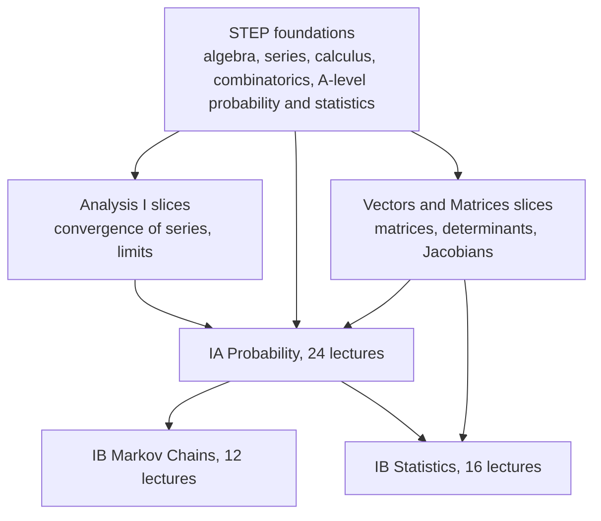
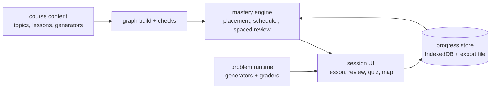

# Mastery courses: design

Dated 2026-10-04. Status: approved by the owner on 2026-10-04. Building the slice graph (first review gate).

## Problem

Albert wants to learn the Cambridge Mathematics and Computer Science courses from scratch to mastery, on his own, with the structure that makes Math Academy and PhysicsGraph work: a map of small topics with prerequisites, practice that never runs out, reviews spaced so nothing decays, and visible progress. No existing product covers Cambridge-level content this way, and lecture notes plus example sheets alone give no feedback loop.

## Decisions so far (owner, 2026-10-04)

1. **Learner:** Albert only. No accounts, no multi-user features, no polish for strangers.
2. **First subject:** probability and statistics.
3. **Foundation:** start below the Tripos, at STEP level, and build upward. STEP also serves as the initial placement test.
4. **Proof grading:** structured proofs (and Lean for a core set) can gate mastery; free-form proofs are practice only.
5. **Content:** AI-drafted lessons and problems are fine if every claim is computed or checked and Albert reviews before anything ships.
6. **Session length:** 60 minutes a day.
7. **Devices:** mostly the Mac, also the phone. Desktop layout first; every view must work on a phone.
8. **Placement starts below STEP:** the graph's roots are pre-A-level and A-level basics (fractions, algebra, indices, sequences, sigma notation, basic probability), so gaps under STEP are caught.
9. **Shared package:** the mastery engine is `packages/mastery`, used by every course from the start.
10. **One shared knowledge graph across all courses** (2026-10-04). A topic is defined once and can belong to several courses (for example induction in Numbers and Sets and in CS Discrete Mathematics; Bayes in IA Probability and CS Introduction to Probability). A course is a target set of topics; placement, the frontier, and scheduling work on the closure of the chosen courses. A topic's source becomes a list of citations, one per course that teaches it. Changed at the engine gate review, before a second course exists.
11. **Every course starts from scratch** (2026-10-04). No course assumes what the learner already knows. Fast progress comes only from the placement test and mastery checks, measured from answers, never from assumptions about the learner.
12. **Code exercises run locally** (2026-10-04). Exercises in OCaml, C++, Prolog, and other languages are graded by a local runner (tests on Albert's machine) whose results are recorded into progress. Running code in the browser is a separate, later project.
13. **Object-oriented programming is taught in C++, not Java** (2026-10-04). A deliberate substitution for the CS Tripos IA Object-Oriented Programming course (which uses Java). Topics shared with IB Programming in C and C++ are defined once in the shared graph.
14. **Two courses at once, interleaved daily** (2026-10-04): Maths IA Probability and CS Discrete Mathematics run in parallel. Shared foundations are learned once; each day's 60 minutes mixes both courses, split evenly by default (the split is a setting). Discrete Mathematics needs its own slice graph (new foundations: logic and quantifiers, divisibility and remainders, functions as mappings), reviewed like the probability slice before content is written.
15. **Hardware labs are simulated in Verilog** (2026-10-04) with open-source tools inside the runner VM (for example Icarus Verilog or Verilator). Group projects, design and studio courses (Interaction Design, Further HCI, Further Graphics), and essay courses (Economics, Law and Ethics; Business Studies; Cybercrime) are left out.
16. **The code runner** (2026-10-04): exercises run inside a dedicated Multipass VM with the course toolchains (OCaml, C++, SWI-Prolog, Verilog). Results reach the course through an automatic folder the course watches (the File System Access API, which Chrome supports and Safari does not); an import button remains as the fallback.
17. **CS course order** (2026-10-04): CST IA Discrete Mathematics (now, alongside Maths IA Probability), then CST IA Foundations of Computer Science (OCaml; the first course with code exercises, so the local runner is built with it, under its own design doc and review), then CST IA Algorithms 1 and 2. Later branches are chosen when these are done.
18. **Gate 3 review** (2026-10-04): progress document version 2 with migration; beta tools are deployed at an unlisted URL (not in the catalog); a review is two problems and both must be right, a quiz is one problem per topic; "Learn it now" on the map is kept. **No self-report anywhere** (decision 11): placement probes only topics that have real problems; a topic without content cannot be passed or learned and stays unknown until its content exists (shown as "lesson not written yet", never scheduled). **Map:** show only the selected topic's prerequisite and dependent edges by default, with a toggle to show all.
19. **Owner feedback on the live course** (2026-10-04): (a) one universal way home on every screen, including before placement: a persistent header whose title always goes home (Start before placement, Today after), plus a Home item in the navigation; no screen is a dead end. (b) All mathematics is written and rendered as LaTeX (KaTeX, bundled locally, no CDN), in lessons, examples, problems, feedback, glossary, and the map; computed numbers are inserted into the LaTeX, still never typed by hand. (c) Answer entry is easier: a text box that accepts natural forms (3/8, 3 / 8, 0.375, 3÷8, 2^5, 2×3, sqrt(2)), shows a live LaTeX preview of how the answer was read, and has a small keypad of math symbols that inserts at the cursor; phone keyboards get the right input mode.
20. **A teaching tool, not a placement-driven path** (2026-10-04): there is no placement test. The learner chooses the courses to study, and each course is taught from its foundations in the graph's order; the engine's scheduler, spaced review, and mastery checks stay. For now the only option is Maths IA Probability and CST Discrete Mathematics together. The placement code stays in the engine, unused by the app.

## Goals (v1)

1. A knowledge graph for the probability and statistics track, from STEP foundations to Part IB Statistics, with every topic traced to its source in the official schedules or the STEP specification.
2. A placement test that finds what Albert already knows, so the course starts at his frontier.
3. Mastery learning: a topic unlocks only when its prerequisites are passed.
4. Spaced review that gives partial credit to prerequisites when an advanced topic is practiced, so review load stays bounded as the graph grows.
5. Daily sessions sized to a time budget, mixing new lessons, reviews, and quizzes.
6. Auto-graded practice with fresh variants every time.
7. Progress shown as the graph itself, plus a learnhub catalog card.
8. External checks against real Cambridge material (below), the course's equivalent of the cache simulator's hardware benchmarks.

## Non-goals (v1)

- The CS track, and maths courses outside this track (they come after the engine is proven on one track).
- Lean in the browser. Lean needs a server or a heavy WebAssembly build; deferred.
- Free-form proof grading, by a human or AI, as a mastery gate.
- Accounts, sync across devices, leaderboards, social features.
- Copying Cambridge or OCR material. Lecture notes, example sheets, STEP papers, and STEP Support Programme modules are copyrighted (the Support Programme pages carry "© 2025 University of Cambridge"). The platform links to them; all lesson and problem content is original.

## The track: what it covers

Source: *Schedules of Lecture Courses and Form of Examinations for the Mathematical Tripos 2026-27*, Faculty of Mathematics, University of Cambridge ([PDF](https://www.maths.cam.ac.uk/undergrad/files/schedules.pdf)).



| course | schedule sections (lecture counts from the schedules) |
|---|---|
| IA Probability (24, Lent) | Basic concepts [3]; Axiomatic approach [5]; Discrete random variables [7]; Continuous random variables [6]; Inequalities and limits [3] |
| IB Markov Chains (12, Michaelmas) | Discrete-time chains [5]; Recurrence and transience [3]; Invariant distributions and convergence [3]; Time reversal [1] |
| IB Statistics (16, Lent) | Estimation [6]; Hypothesis testing [4]; Linear models [6] |

Only the slices of Analysis I and Vectors and Matrices that these courses use are in the graph (for example, absolute convergence for generating functions, Jacobians for transformations of random variables, matrix algebra for linear models). Part II courses (Principles of Statistics, Statistical Modelling, Applied Probability, Probability and Measure) are phase 2; Probability and Measure also needs Part IB Analysis and Topology, which this track does not cover.

**Size estimate (a guess, not a count):** Math Academy-sized topics run about 2 to 4 per lecture, so roughly 50 to 100 topics for IA Probability, 25 to 50 for Markov Chains, 30 to 60 for Statistics, plus 80 to 150 for the STEP and Analysis or Vectors and Matrices foundations it needs: about 200 to 350 topics in all. The real count comes out of building the graph.

## The role of STEP

STEP (Sixth Term Examination Paper) is Cambridge's admissions exam, now administered by OCR. The Faculty of Mathematics and NRICH run the free STEP Support Programme: 25 Foundation modules, then STEP 2 and STEP 3 modules ([overview](https://step.maths.org/step-support-modules-overview)).

STEP is used three ways:
1. **Foundation layer of the graph.** The bottom of the graph is the A-level Mathematics and Further Mathematics content in the STEP specifications, restricted to what the track needs.
2. **Placement test.** Original STEP-style questions, chosen adaptively, find Albert's frontier. Knowing a topic implies knowing its prerequisites, so one correct answer can place several topics at once.
3. **Problem-solving practice.** STEP questions are long and unstructured, unlike drill. The course has a separate "challenge" task type in that style, which never gates progress but builds the skill.

## External checks (the course's "real hardware")

The cache simulator checks its model against real CPUs. A course checks its teaching against real Cambridge material, which it links to and never copies:

| milestone | check | how |
|---|---|---|
| STEP foundations done | STEP Support Programme Foundation modules on the same topics (for example module 6: arrangements, probability) | Albert attempts them under time, marks against the published solutions, records the score |
| Each Tripos course done | That course's Cambridge example sheets, where public, and past Tripos questions | Same: attempt, self-mark, record |

Scores go into a CHECKS.md log, like VERIFY.md. A topic area where Albert passes in the app but fails the real questions is a mismatch to fix in the lessons.

## Architecture



All of it runs in the browser as static files, so it deploys to the existing GitHub Pages site as a learnhub tool with a new manifest level, `course`.

### Topic format

One file per topic in the course folder, reviewed like code:

```ts
export default topic({
  id: 'prob.bayes-formula',
  title: "Bayes's formula",
  // One citation per course that teaches the topic (shared graph, decision 10).
  sources: [{ doc: 'tripos-schedules-2026-27', course: 'IA Probability', section: 'Axiomatic approach', verified: true }],
  prereqs: ['prob.conditional-probability', 'prob.law-of-total-probability'],
  // Practicing this topic also counts as partial review of these, with this weight.
  encompasses: { 'prob.conditional-probability': 0.5, 'prob.law-of-total-probability': 0.5 },
  lesson: lesson`...`,                 // explanation, using live computed numbers only
  examples: [workedExample(...)],      // every number computed, checked in tests
  practice: [generator(bayesTwoUrns), generator(bayesDiagnosticTest)],
  mastery: { correctInARow: 3 },       // or a quiz score threshold
});
```

### Mastery engine

- **Placement:** adaptive. Ask a question at a topic, then move up or down the graph based on the answer; a correct answer credits the topic and its prerequisites.
- **Frontier:** topics whose prerequisites are all mastered and which are not mastered themselves.
- **Spaced review:** each mastered topic has a memory state (repetitions, interval, next due date). A review stretches the interval on success and shrinks it on failure. Practicing a topic adds fractional review credit to every topic it encompasses, down the graph, which is how Math Academy keeps review volume from growing with the graph. The exact model starts simple (interval doubling with the fractional credit) and is tuned from Albert's real review data.
- **Daily session:** a time budget (Albert sets it), filled in order: overdue reviews that cannot be covered implicitly, then new frontier lessons chosen so their practice also covers due reviews, then a quiz every few topics. Topics from different areas are interleaved.

### Problem runtime and graders

| type | grading | notes |
|---|---|---|
| Exact answer | exact rational or integer comparison | probabilities as fractions (BigInt rationals), not floats |
| Numeric answer | relative tolerance | for continuous distributions, statistics |
| Expression | equivalence by evaluating both expressions at random points (randomized identity testing), plus a symbolic simplify where it is cheap | answers like `n p (1-p)` |
| Multiple choice | exact | used sparingly; distractors come from known misconceptions |
| Structured proof | order steps, fill gaps, pick each step's justification | the gate for proof topics such as Stirling's formula or the weak law |
| Construction | the learner's object is run against checks | for example a Markov chain transition matrix with given properties |
| Challenge | self-marked against a worked solution | STEP style; never gates |

Every generator has a reference solver. Tests run each generator over many seeds and check that the solver's answer is accepted, that wrong answers from common misconceptions are rejected, and that parameters stay in sensible ranges.

### Checks in CI (the "numbers are never typed" rule)

- The graph has no cycles, every prerequisite exists, every topic is reachable from the roots, and every topic cites a schedule or STEP section.
- Every number in a lesson or worked example comes from code, and is tested.
- Probability claims are checked twice: exact computation where possible, and a Monte Carlo run that must agree within its confidence interval.
- No em or en dashes; terms are defined before use (the same checks as the cache simulator's lessons).

### Progress storage

Albert only, so progress stays in the browser (IndexedDB), with **Export** and **Import** of a progress file so nothing is lost if the browser is cleared, and so it can move between the Mac and a phone by hand. Supabase sync stays a phase 2 option that needs a schema and Albert's approval.

## MVP (ruthless)

One thin vertical slice, end to end:
1. **Content:** about 40 to 60 topics: pre-A-level and A-level roots, the STEP foundations for discrete probability (counting, arrangements, sums, A-level probability), plus IA Probability "Basic concepts" and "Axiomatic approach" (8 of its 24 lectures).
2. **Engine:** placement test, frontier, mastery gating, spaced review with fractional credit, daily session with a time budget.
3. **Problems:** exact, numeric, expression, multiple choice, and structured proof graders.
4. **UI:** lesson view, practice, review, quiz, the knowledge map, export and import.
5. **Deploy:** a learnhub tool with level `course`, live on the existing site.
6. **Success test:** after two weeks of daily use, Albert scores well on the matching STEP Foundation questions and on the first IA Probability example sheet, recorded in CHECKS.md.

Pause for review after the graph for the slice (topic list and edges, before any lessons are written), after the engine, and after the first 10 topics of content.

## Phase 2 (noted, not built)

- The rest of IA Probability, then IB Markov Chains and IB Statistics.
- Lean for a core set of proofs.
- The CS track (Foundations of CS in OCaml, Discrete Mathematics), with the cache simulator as a lab inside Computer Architecture.
- Supabase progress sync.
- Part II statistics and probability courses.

## Open questions

None open. Answered 2026-10-04 (decisions 6 to 9 above).
