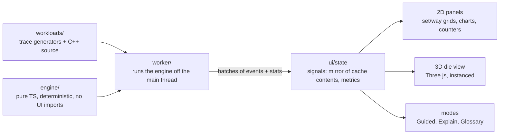

# Cache Hierarchy Simulator: design

A teaching tool: pick hardware and a C++ access pattern, then watch each memory access move through L1, L2, L3, and DRAM, with hits, misses, evictions, and coherence between cores visible as they happen.

## Layers

| path | owns | depends on |
|---|---|---|
| `src/engine/` | `Simulator`, `Cache`, presets, address breakdown | nothing (no DOM, no UI) |
| `src/workloads/` | 10 workloads (`Workload` in `types.ts`), custom trace parser | `engine/types` only |
| `src/worker/` | `sim.worker.ts` + typed message protocol | engine, workloads |
| `src/ui/` | Preact app, panels, 2D grids, charts, 3D view, modes | worker protocol, engine types |
| `bench/`, `scripts/` | real C++20 benchmarks, per-OS verify scripts | nothing in `src/` |

## Frozen contracts
- **Engine:** `src/engine/types.ts` and `src/engine/index.ts`. `Simulator.access(a)` returns `AccessOutcome { index, access, servedBy, cycles, events[] }`; `stats()` returns `Stats`; `caches[i].lines` / `.state` are the live contents (typed arrays, slot = set × ways + way).
- **Workloads:** `src/workloads/types.ts` (`Workload`, `ParamSpec`, `TraceContext`), `WORKLOADS` and `workloadById` from `src/workloads/index.ts`; `parseTraceText` and `customWorkload` for workload 10.

## Worker protocol (owned by the UI stage; summary)
Main thread sends `configure { config, workloadId, params | traceText }`, `step { n }`, `runTo { index }` (fast-forward without per-access animation), `reset`. Worker replies with `batch` messages: per access `{ index, addr, core, kind, src, servedBy, cycles }` and a flat event list (cache, set, way, kind, line, miss, state), plus `stats` snapshots. The main thread keeps a mirror of each cache's slot states, updated only from events, so rendering never asks the worker for full cache contents.

## Playback and performance
- **Speed:** 1× plays a readable number of accesses per second (fixed, documented in the UI); the slider spans 0.5× to 8×. **Step** advances one access. **Run to end** computes the rest in the worker without animating each access, then updates the view once.
- **60 fps** at any trace length: per frame, the renderer applies at most the batch for that frame and draws caches with instanced meshes (3D) or a canvas (2D), so frame cost depends on cache geometry and batch size, never on trace length. Large caches (an L3 has up to ~600k lines) are drawn as aggregated tiles (several sets per tile) with a zoom-in to exact sets.

## Theme
Light theme. Meridian's app is dark-only, so only its non-color tokens carry over (font stacks, spacing, radii). Colors are chosen for WCAG AA on a light background. Event colors: hit green, miss red, eviction orange, invalidation purple; each also has a non-color cue (icon or pattern) for color-blind users.

## Model limitations (also in README)
- Serial timing: each access costs the latency of the level that served it. No out-of-order overlap, memory-level parallelism, or store buffer, so absolute cycles are pessimistic; trends are what is taught and verified.
- One MESI state per core across its private caches; a directory at the shared level. Private L2 is inclusive of L1 (real Intel and AMD L2s are not strictly inclusive).
- Large L3s are one monolithic cache indexed by modulo; real Intel L3s hash addresses across slices.
- No TLB, no virtual-to-physical translation (addresses are treated as physical), no DRAM banks or row buffers.
- Prefetchers: next-line and a single-stream stride detector per core, both stopped at 4 KiB page boundaries. Real CPUs run several prefetchers with many streams.
- Instruction fetches are modeled only for traces that include them (`I` accesses).
- Miss kinds: the classic three (compulsory, capacity, conflict) plus **coherence**, so false sharing is visible as its own category.
